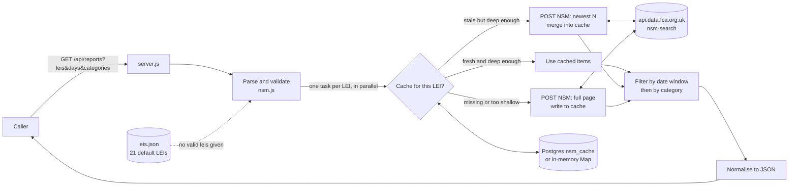

# Handover: fca-nsm-api

> **Not supplied by requester:** target platform and business purpose. Both are left open (see [Open questions](#open-questions)).
> Status legend: **UNVERIFIED** = not provable from this repo.

## What it does

- A small HTTP service with one endpoint, `GET /api/reports` (`server.js:13`).
- For a list of companies (identified by LEI), it asks the FCA's National Storage Mechanism (NSM) for their regulatory filings (`nsm.js:135-155`).
- It keeps only filings from the last N days in chosen categories (default: half-year and annual financial reports) and returns them as JSON (`nsm.js:253-305`).
- Results are cached per company, in memory or in Postgres, to reduce calls to NSM (`nsm.js:157-246`, `cacheStore.js`).
- Taken from a larger app, `RNS_Update`. Digests, push notifications, feeds and the UI were not carried over (`README.md:3-8`). That repo was not reviewed.

## Inputs, steps, outputs, schedule

**Inputs** (query string, all optional; `server.js:14-18`, `nsm.js:48-72`)

| Param | Format | Default | Handling |
|---|---|---|---|
| `leis` | Comma-separated LEIs | All 21 in `leis.json` | Trimmed, upper-cased, de-duplicated. Invalid entries are dropped silently. |
| `days` | Integer | `7` | Clamped to 1–365. A non-number becomes 7. `parseInt` accepts `"7abc"` as 7. |
| `categories` | Comma-separated text | `Half-year Financial Report,Annual Financial Report` | Exact match, case-insensitive. An empty value uses the default. |

**Steps**

1. Parse and validate the inputs (`nsm.js:254-264`).
2. Work out the page size per LEI: `min(1000, max(100, days × 15))` (`nsm.js:74-76`).
3. For each LEI, **in parallel**, read the cache (see [Caching](#business-rules-and-edge-cases)), or POST to NSM (`nsm.js:266`).
4. If every LEI fails, return 502. Otherwise carry on (`nsm.js:268-271`).
5. Keep filings whose date is on or after `now − days` (`nsm.js:273-283`).
6. Filter by category, then normalise each filing (`nsm.js:96-108`, `nsm.js:284`).
7. Return JSON.

**Outputs**

| Status | When | Body |
|---|---|---|
| 200 | At least one LEI succeeded | `leis, dateFrom, days, categories, scanned, count, reports[], failedLeis?, cachedLeis?, deltaLeis?, cacheBackend` (`nsm.js:289-303`) |
| 400 | No valid LEIs and `leis.json` is empty | `{error}` (`nsm.js:256-258`) |
| 502 | Every LEI failed | `{error, details}` (`nsm.js:269-271`) |
| 404 | Any other path or method | `{error:"Not found"}` (`server.js:24-25`) |

Fields on each report (`nsm.js:96-108`):

| Field | Source |
|---|---|
| `lei` | NSM `lei` |
| `company` | Non-blank `leis.json` name, else NSM `company`, else the LEI |
| `title` | NSM `headline`, else `type`, else `"(untitled)"` |
| `category` | NSM `type` |
| `publishedAt` | NSM `publication_date`, else `document_date`, else `submitted_date`. Passed through as-is, not reformatted. |
| `url` | `https://data.fca.org.uk/artefacts/` + `download_link`, else `html_link`, else null |
| `id` | NSM `disclosure_id`, else `_id` |
| `raw` | The full NSM item, unchanged |

**Schedule:** none. The service only runs when a request comes in. There is no timer, cron job or background job in the repo. Whatever calls the endpoint, and how often, is **UNVERIFIED**.

## Data flow

## External dependencies

| Dependency | Detail | Auth | What breaks if it changes |
|---|---|---|---|
| FCA NSM search API | `POST https://api.data.fca.org.uk/search?index=nsm-search` (`nsm.js:17`) | None. Browser-like `Origin`, `Referer` and `User-Agent` headers are sent (`nsm.js:40-46`). | **Everything.** The endpoint is undocumented and was worked out from a captured browser request (`nsm.js:7-12`, `README.md:10-13`). Any change to the request body, date format, response shape (`hits.hits[]._source`) or bot filtering breaks it. A timestamp with milliseconds once returned 404 (`nsm.js:78-84`). |
| FCA document links | `https://data.fca.org.uk/artefacts/` + `download_link` (`nsm.js:18, 92-94`) | None | `url` fields in the response point to the wrong place |
| Postgres (optional) | Used when `DATABASE_URL` is set. Creates table `nsm_cache` on first use (`cacheStore.js:39-55`). | Credentials in `DATABASE_URL` | The cache is lost. Requests still succeed without it, and the error is logged for each LEI on each request (`nsm.js:206-228`). |
| `pg` npm package (optional) | `^8.23.0` (`package.json:10-12`) | n/a | Same as Postgres being unavailable |
| Node.js ≥ 18 | Uses the built-in `fetch` (`package.json:13-15`) | n/a | n/a |
| GLEIF (manual only) | Suggested for looking up LEIs (`README.md:78`). Not called by the code. | n/a | n/a |

## Business rules and edge cases

- **One request per LEI.** NSM filters by `company_lei` on its side (`nsm.js:10-12`).
- **Fixed request body.** The body copies a captured browser request exactly: `company_lei` value `["", LEI, "disclose_org", "related_org"]`, `latest_flag: "Y"`, sort `submitted_date desc`, `dateCriteria` with `from: null` and `to: now`. Timestamps have no milliseconds (`nsm.js:110-133`). The server applies no "from" date; the date window is applied afterwards in code.
- **Date window.** The cutoff is now minus N days, keeping the current time of day (not midnight) (`nsm.js:86-90`). An item's date is `publication_date`, else `document_date`, else `submitted_date`. Items without a valid date are dropped (`nsm.js:273-283`). The `README.md:49` example shows a midnight `dateFrom`, which does not match the code.
- **Date field mismatch.** NSM sorts by `submitted_date`, but the window filter uses `publication_date` first. If a filing's publication date is much older than its submission date, the window may treat it differently than expected. **UNVERIFIED** whether this happens in real data.
- **Page size limit.** At most `min(1000, max(100, days×15))` items per LEI. A company with more filings than that in the window loses the older ones without any warning (`nsm.js:24-28`).
- **`scanned`** counts filings inside the window before the category filter (`nsm.js:296`).
- **Category matching** compares the whole string, ignoring case. `Net Asset Value(s)` does not match `Net Asset Value(s) - correction` (`test/nsm.test.js:58-68`).
- **Partial failure.** Returns 200 and lists the failed LEIs in `failedLeis`, with error text and up to 2,000 characters of response body (`nsm.js:147-150`).
- **Caching** (`nsm.js:157-246`):
  - Key: the LEI only. One entry serves any shorter window and any category filter.
  - Fresh (younger than the TTL) and page size at least as large as needed: serve from the cache (`cachedLeis`).
  - Stale but page size large enough: fetch only the newest `min(1000, max(100, elapsedDays×15))` items and merge them in (`deltaLeis`). If that fetch fails, serve the stale entry and report it as cached.
  - Merge: match by `disclosure_id`, else `_id`, else `lei|type|date|headline`. The newer copy wins. Sort newest first (`nsm.js:181-197`).
  - Missing, or page too small: full fetch. Failed fetches are not cached.
  - **Different from the README.** `README.md:89` says `NSM_CACHE_TTL_MINUTES=0` disables caching. In the code, 0 only stops fresh-cache hits. Results are still stored, and each later request does a catch-up fetch (`nsm.js:177-179, 234-241`). The test `test/deltaFetch.test.js` relies on this behaviour.
- **Company names.** A non-blank name in `leis.json` overrides NSM's company name (`nsm.js:97-100`).

## Config settings

| Setting | Where | Default | Effect |
|---|---|---|---|
| `PORT` | env (`server.js:8`) | `3000` | HTTP port |
| `NSM_CACHE_TTL_MINUTES` | env (`nsm.js:171-174`) | `10` | Cache freshness. Any invalid value becomes 10. For `0`, see above. |
| `DATABASE_URL` | env (`cacheStore.js:6-7`) | unset (memory cache) | Turns on the Postgres cache. **Contains credentials.** |
| `DATABASE_SSL_CA` | env (`cacheStore.js:21-23`) | unset | CA certificate in PEM format. Literal `\n` sequences are converted to newlines. |
| `DATABASE_SSL_VERIFY` | env (`cacheStore.js:20`) | verify | `false` turns off TLS certificate checks |
| `sslmode` in `DATABASE_URL` | connection string | n/a | Overrides both SSL settings above (`cacheStore.js:16-18`) |
| `TEST_DATABASE_URL` | env, tests only (`test/postgresCache.test.js:7`) | unset | Runs the Postgres test |
| Default LEI list | `leis.json` | 21 entries | Used when no valid `leis` param is given |
| Hard-coded constants | `nsm.js:17-36` | default 7 days, range 1–365, 15/day, max 1000, default categories, LEI regex `^[A-Z0-9]{20}$` | Change requires a code edit |

**Secrets check:** no real credentials found in the repo. `README.md:111` has a placeholder connection string (`user:password@host`). `.env` is git-ignored (`.gitignore:2`). In production, `DATABASE_URL` is a secret and belongs in a secret store.

## Known limitations

- **A malformed NSM response can crash the service.** `response.json()` has no error handling (`nsm.js:152`), and the request handler has no try/catch (`server.js:13-21`). I confirmed that `fetchReports` throws on invalid JSON. Under Node's default settings, that unhandled error terminates the process (from reading the code; not run against the live server).
- No timeout on NSM calls (`nsm.js:138`). One slow LEI holds up the whole response.
- All LEIs are requested at once with no limit on concurrent calls (`nsm.js:266`). With 21 default LEIs, that is 21 simultaneous calls to NSM.
- Two simultaneous requests for the same LEI both go to NSM. There is no sharing of in-progress requests.
- The in-memory cache has no size limit and no eviction. Cached item lists also grow with every merge (`nsm.js:175, 238-239`).
- No authentication, rate limiting, CORS headers or health endpoint (`server.js:1-3`).
- The page-size limit can silently cut results (see above).
- The catch-up fetch misses filings if more than its page size were filed since the last fetch.
- `clearCache()` clears only the memory cache, never Postgres (`nsm.js:248-251`).
- No logging apart from cache errors and the startup line.
- Tests always mock NSM. There is no test against the live API (`test/nsm.test.js:1`).

## Open questions

1. **Business purpose and target platform:** not supplied by the requester.
2. **Default LEI list:** is it correct? Only 2 of the 21 are confirmed. The README warns the list may be misaligned against the original ISINs (`README.md:80-84`). **UNVERIFIED.**
3. **Who calls this endpoint, how often, and what they do with the results?** Digests and notifications lived in `RNS_Update`, which was not reviewed. **UNVERIFIED.**
4. **FCA permission:** does the FCA allow automated use of this undocumented endpoint? Is there an official NSM API or data feed that should replace it? **UNVERIFIED.**
5. **Date for the window:** should it be `publication_date` or `submitted_date`?
6. **TTL of 0:** should it mean "no cache at all" (what the README says) or the current code behaviour?
7. **Other categories:** are they needed? What are the full valid `type` values? Only three were seen: `Half-year Financial Report`, `Annual Financial Report`, `Net Asset Value(s)`. **UNVERIFIED** that this is the full list.
8. **Hosting:** Render's free tier is mentioned as an example (`README.md:106`). Where it actually runs is **UNVERIFIED**.
